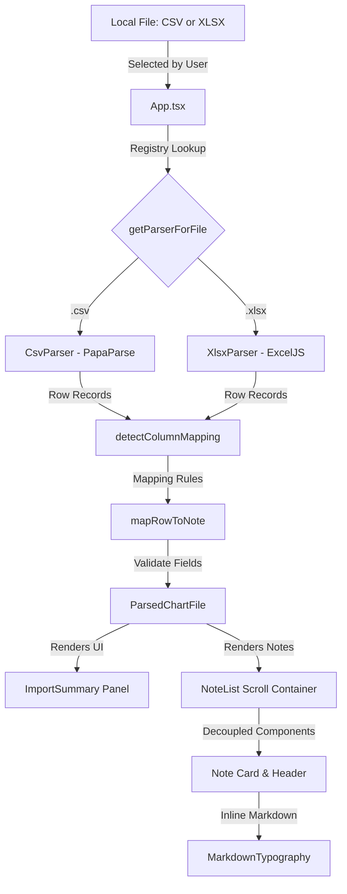

# KI-Journalgranskaren Documentation

KI-Journalgranskaren is a local, offline patient chart note viewer designed for Karolinska Institutet (KI). It allows researchers to load CSV or Excel spreadsheet journal exports, auto-maps columns, and displays patient notes in a clean, scrollable interface styled after MedBench.

> **🔗 Try it in the browser:** A static build is published to GitHub Pages at **https://gforge.github.io/Journalgranskaren/** on every push to `main`. It runs fully client-side (no uploads), so you can explore the bundled example datasets without installing anything. For real patient data, use a local build or the desktop executable on an approved research computer.

---

## 1. Data Flow & System Architecture

All parsing and data processing happen entirely inside the application's local memory. No network connections are initialized, ensuring data remains secure on local research machines.



The only data that persists between sessions is the **audit log**, which is stored locally in the browser's IndexedDB (never transmitted). See section 2.

---

## 2. Tamper-Evident Audit Log (Hash Chain)

Every reviewer action — loading a file, opening a chart, switching to the labs/medications tab, or marking a patient as done — is appended to a local audit log in IndexedDB (`ki_audit_db` → `logs` store). The log is **append-only and tamper-evident**: each entry is cryptographically chained to the one before it.

### How the chain works

When a new entry is written ([`addAuditLog`](../src/db.ts)), the app:

1. Reads the most recent entry and takes its `hash` as `prevHash` (the first entry uses a genesis value of `0`).
2. Computes a SHA-256 digest over the entry's fields, joined with `|`:

   ```
   hash = SHA-256( prevHash | timestamp | reviewerName | action | patientId | details )
   ```

3. Stores both `hash` and `prevHash` on the entry.

SHA-256 is computed with the Web Crypto API (`crypto.subtle.digest`). A weak non-cryptographic fallback is only used in the (non-secure-context) case where `crypto.subtle` is unavailable.

Because each hash depends on the previous hash, altering, deleting, or re-ordering any entry invalidates every entry after it.

### Verification

On the **Patient Overview** screen, [`verifyAuditLogChain`](../src/db.ts) re-reads the whole log (sorted by ascending `id`), recomputes each hash, and checks that every entry's `prevHash` matches the previous entry's `hash`. The result surfaces as a status chip:

| State | Meaning |
| --- | --- |
| ✅ **Audit log chain integrity verified** | All hashes recompute correctly and link to their predecessor. |
| ⚠️ **Audit log integrity compromised** | A hash mismatch or broken link was found; the tooltip reports the offending entry ID. |

Entries written before the hash chain feature existed (no `hash`/`prevHash`) are skipped during verification so legacy logs don't raise false alarms.

### Export

**Export Audit Logs (CSV)** on the same screen ([`downloadAuditLogsCSV`](../src/db.ts)) writes the full log — including the `Hash` and `PrevHash` columns — to a timestamped CSV for external archival or independent re-verification.

---

## 3. Included Examples (`docs/example/`)

We provide two example datasets to demonstrate parsing behavior:

### [chart_only.csv](example/chart_only.csv)
*   **Purpose**: Demonstrates standard chart-only export parsing.
*   **Headers**: Uses Swedish column names (`Personnummer`, `Tidpunkt`, `Kategori`, `Skribent`, `Journaltext`).
*   **Output**: 3 journal notes parsed successfully with zero warnings, showing date, category, author, and formatted text.

### [chart_labs_meds.csv](example/chart_labs_meds.csv)
*   **Purpose**: Demonstrates exports containing extra lab values and medications columns.
*   **Headers**: Contains additional columns like `LabTest`, `LabValue`, `LabUnit`, `MedicationName`, etc.
*   **Output**: The note text is parsed successfully. The unmapped columns are skipped for rendering in this MVP version, generating safe, non-blocking warnings in the import summary panel.

---

## 4. Automatic Column Detection (Aliases)

The application cleans and matches header columns against a set of predefined Swedish and English keywords:

*   **Patient ID**: `patientid`, `patient_id`, `personnummer`, `pnr`, `patient`, `id`
*   **Date & Time**: `datetime`, `date_time`, `datum`, `tidpunkt`, `journaldate`, `noteringsdatum`, `date`, `tid`
*   **Note Type**: `notetype`, `note_type`, `typ`, `anteckningstyp`, `rubrik`, `sökord`, `kategori`
*   **Author/Signer**: `author`, `författare`, `signatur`, `skapad av`, `skribent`, `signerare`
*   **Content (Required)**: `content`, `text`, `journaltext`, `anteckning`, `notering`, `note`, `fritext`, `textinnehåll`

---

## 5. How to Build and Distribute

### **Development mode**
Run the local Vite web development server:
```bash
npm run dev
```

### **1. Static Web Fallback (HTML/JS)**
Compile the project to raw, standalone assets:
```bash
npm run build
```
This generates output inside the `/dist` directory. You can open `dist/index.html` directly in any modern browser on your research computers without hosting or installing dependencies.

### **2. Desktop Executable (Tauri wrapper)**
To compile a standalone native executable for Windows or macOS:
```bash
npm run tauri build
```
The compiled binaries are placed under `src-tauri/target/release/`.
*   **Windows**: Produces a single, portable `.exe` file that runs without administrator privileges.

### **3. GitHub Pages (hosted demo)**
Every push to `main` runs the [`Deploy to GitHub Pages`](../.github/workflows) workflow, which executes `npm ci && npm run build` and publishes the `/dist` output to the `gh-pages` branch. The result is served at **https://gforge.github.io/Journalgranskaren/**. The Vite `base` is set to `/Journalgranskaren/` so asset paths resolve under that sub-path. The hosted demo still runs entirely client-side, but it is intended for demonstration with the example data only — not for real patient journals.
