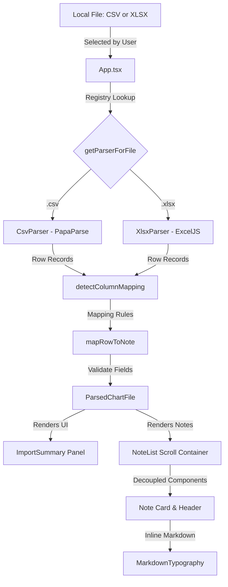

# KI-Journalgranskaren Documentation

KI-Journalgranskaren is a local, offline patient chart note viewer designed for Karolinska Institutet (KI). It allows researchers to load CSV or Excel spreadsheet journal exports, auto-maps columns, and displays patient notes in a clean, scrollable interface styled after MedBench.

---

## 1. Data Flow & System Architecture

All parsing and data processing happen entirely inside the application's local memory. No network connections are initialized, ensuring data remains secure on local research machines.



---

## 2. Included Examples (`docs/example/`)

We provide two example datasets to demonstrate parsing behavior:

### [chart_only.csv](file:///home/max/workspace/ki_chart_reviewer/docs/example/chart_only.csv)
*   **Purpose**: Demonstrates standard chart-only export parsing.
*   **Headers**: Uses Swedish column names (`Personnummer`, `Tidpunkt`, `Kategori`, `Skribent`, `Journaltext`).
*   **Output**: 3 journal notes parsed successfully with zero warnings, showing date, category, author, and formatted text.

### [chart_labs_meds.csv](file:///home/max/workspace/ki_chart_reviewer/docs/example/chart_labs_meds.csv)
*   **Purpose**: Demonstrates exports containing extra lab values and medications columns.
*   **Headers**: Contains additional columns like `LabTest`, `LabValue`, `LabUnit`, `MedicationName`, etc.
*   **Output**: The note text is parsed successfully. The unmapped columns are skipped for rendering in this MVP version, generating safe, non-blocking warnings in the import summary panel.

---

## 3. Automatic Column Detection (Aliases)

The application cleans and matches header columns against a set of predefined Swedish and English keywords:

*   **Patient ID**: `patientid`, `patient_id`, `personnummer`, `pnr`, `patient`, `id`
*   **Date & Time**: `datetime`, `date_time`, `datum`, `tidpunkt`, `journaldate`, `noteringsdatum`, `date`, `tid`
*   **Note Type**: `notetype`, `note_type`, `typ`, `anteckningstyp`, `rubrik`, `sökord`, `kategori`
*   **Author/Signer**: `author`, `författare`, `signatur`, `skapad av`, `skribent`, `signerare`
*   **Content (Required)**: `content`, `text`, `journaltext`, `anteckning`, `notering`, `note`, `fritext`, `textinnehåll`

---

## 4. How to Build and Distribute

### **Development mode**
Run the local Vite web development server:
```bash
npm run dev
```

### **1. Static Web Fallback (HTML/JS)**
Compile the project to raw, standalone assets:
```bash
npm run build
```
This generates output inside the `/dist` directory. You can open `dist/index.html` directly in any modern browser on your research computers without hosting or installing dependencies.

### **2. Desktop Executable (Tauri wrapper)**
To compile a standalone native executable for Windows or macOS:
```bash
npm run tauri build
```
The compiled binaries are placed under `src-tauri/target/release/`.
*   **Windows**: Produces a single, portable `.exe` file that runs without administrator privileges.
